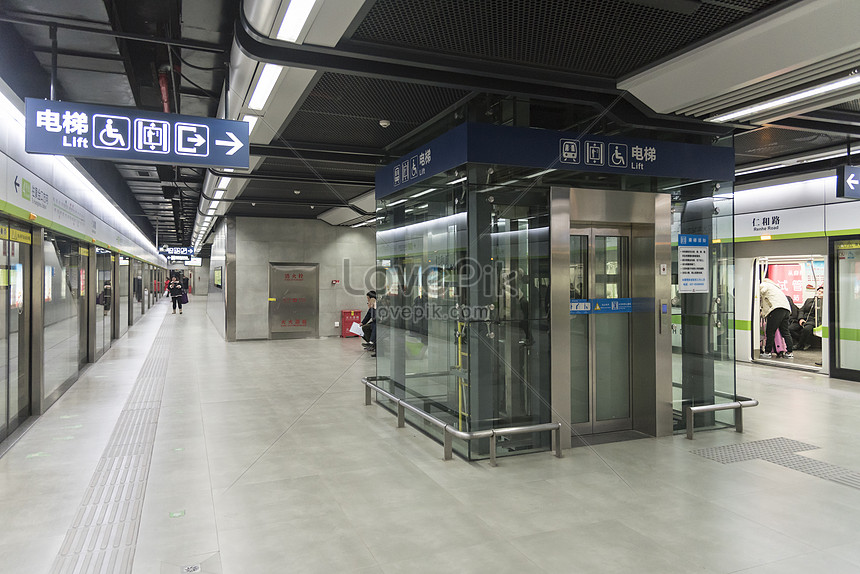

# YOLO를 이용하여 시각장애인의 지하철 이용을 도와주는 프로그램 만들기
###### 신희찬, 이윤호, 박건욱

1. 현재 진행 상황
   + YOLO를 이용하여 이미지 속 지형 인식
     + 계단
     + 엘리베이터
   + 픽토그램 인식
     + 뭐 넣을지 생각해야 함
2. 데이터 수집
   + 지하철역에 가서 직접 데이터 수집
   + 걸어다니면서 필수적인 요소들을 모두 yolo에서 분류하도록 하기
3. 개선 방향 (2학년 때 할 일이 될 수 있음)
   + 픽토그램 묶음이 있는데 이것으로 의미 파악
   + 사진 속 경계선들을 이용하여 다른 오브젝트의 상대적인 위치 파악
   + 휴대폰의 가속도 센서를 이용하여 휴대폰의 각도 계산
   + 이러한 연산으로 사진 속에서 높이가 같은 길 인식 후 가까운 목적지가 보이면 길을 따라가도록
     
     

4. 일단 픽토그램과 의미만 인식하게 하고 위치만 파악하도록 해볼까